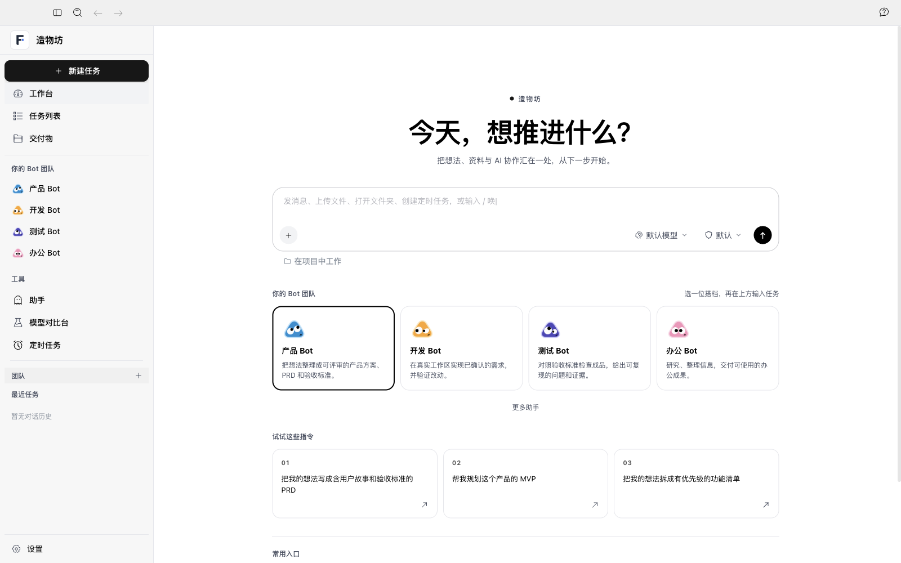
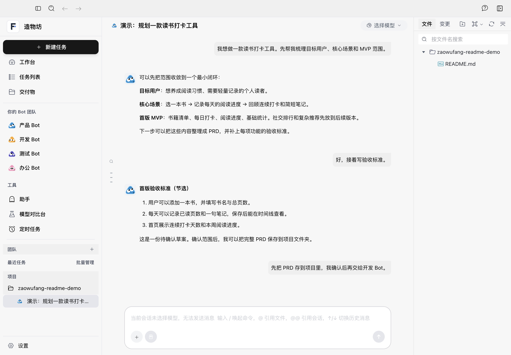

# 造物坊 · Granto

[简体中文](README.md) · [English](README.en.md)

**把想法、资料和 AI 协作放进同一个工作台。** 造物坊是一款 macOS 桌面应用：你可以与不同职责的 Bot 对话，在选定的项目文件夹里处理产品规划、开发、测试和办公任务，并从任务列表与交付物页面回看结果。

> 当前是可体验的预览版。Bot 之间的交接由用户确认和操作；项目不会自动完成从 PRD 到上线的全部步骤。

## 和 Bot 一起推进任务

| Bot | 适合做什么 | 可以交付什么 |
| --- | --- | --- |
| 🔵 产品 Bot | 梳理目标用户、需求、范围与流程 | 产品方案、PRD、用户故事、验收标准 |
| 🟠 开发 Bot | 在选定工作区实现已确认的需求 | 代码、运行说明、验证结果 |
| 🟣 测试 Bot | 对照标准检查交付结果 | 测试记录、可复现的问题与证据 |
| 🩷 办公 Bot | 研究、整理资料与日常办公 | 报告、文档和其他办公成果 |

在首页选择 Bot，输入任务并指定项目文件夹，就能开始一段会话。侧栏的**任务列表**查看真实会话和运行状态；**交付物**按会话查看关联工作区中的文件。

### 从 PRD 到测试

1. 产品 Bot 写 PRD 时调用 Agent Blueprint 辅助分析；你审阅并明确批准具体 PRD 后，它记录批准的文件版本。
2. 点击对话顶部的**交给开发 Bot**。新任务沿用同一工作区；PRD 未批准或批准后被改动时，开发工具会拒绝开工。开发完成后，Bot 登记实际文件和验证结果。
3. 点击**交给测试 Bot**，按 PRD 实测并记录通过或退回。阶段状态保存在工作区的 `.zaowufang/project-workflow.json`，重开应用仍可读取。

交接由你发起；模型仍需按规则调用流程工具。状态记录能阻止未经批准的 PRD 开工，不能替代你对代码和验收结果的判断。

### 对话界面

上图截取自真实安装版界面；“读书打卡工具”对话文字是专门填入的**演示内容**，用于展示消息、Bot 和项目文件区域的排版，并非模型实际输出，也不表示图中的 PRD 已生成。实际发送消息需要先配置可用模型或受支持的本地代理。

## 开始体验

1. 从 [macOS 安装包发布页](https://github.com/siguadht/zaowufang/releases/tag/v2.2.3-zaowufang-workflow) 下载“造物坊”（Apple Silicon）。
2. 在设置中配置可用的模型提供商和 API Key，或项目支持的本地代理/模型。服务费用与可用性取决于提供商。
3. 选择 Bot 和项目文件夹，在输入框里描述任务。建议先让产品 Bot 梳理需求，确认后再切换开发 Bot 和测试 Bot。

这是一个有人参与的工作流：阶段记录和闸门已接入，尚未实现无人值守的跨 Bot 自动执行、自动发布或上线。不同模型、代理和工具的实际能力也会影响结果。

## 项目与许可

`AionUi/` 是 Electron 前端，`AionCore/` 是 Rust 后端。产品范围见 [产品简报](docs/PRODUCT_BRIEF.md) 和 [PRD](docs/ZAOWUFANG_PRD.md)。

造物坊基于[产品经理工作台](https://github.com/Zhouchengjian-user/product-manager-workbench)改造；原项目基于 [AionUi](https://github.com/iOfficeAI/AionUi) 和 [AionCore](https://github.com/iOfficeAI/AionCore)。原仓库基线提交为 `d3179fecb1e528b6a952e58464f08ed434eca33e`。原 README 保存在 [docs/ORIGINAL_PROJECT_README.md](docs/ORIGINAL_PROJECT_README.md)；版权和许可见 [LICENSE](LICENSE)、[NOTICE](NOTICE)、[AionUi/LICENSE](AionUi/LICENSE) 与 [AionCore/LICENSE](AionCore/LICENSE)。

“造物坊”是此改版的产品名，不代表原作者或上游项目为它背书。
